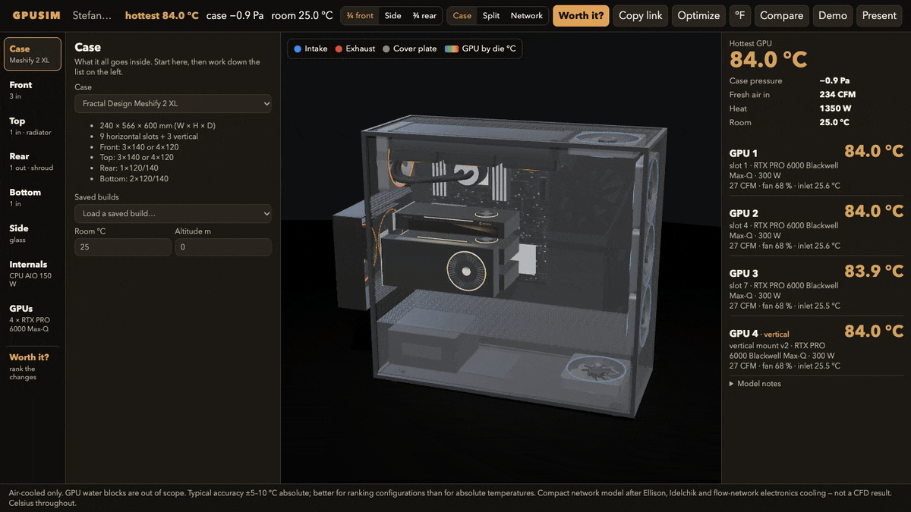

# gpuism — model the case before you change the hardware

[](https://github.com/stefanopineda/gpu-stack-thermal-sim/actions/workflows/ci.yml)
[](https://gpuism.com)



**Would you rip your case apart for 5 °C?** gpuism models the airflow and heat inside an
air-cooled multi-GPU workstation, then ranks every change you could make — fan curve, power
cap, rear shroud, sealing, flipping fans, more fans, spacing the cards — by how many degrees it
buys, how sure the model is, and how much work it is.

**Try it in your browser: [gpuism.com](https://gpuism.com).** Nothing to install. The model runs
on your machine; nothing you build is uploaded. Copy link shares your whole build.

## Run it locally

```bash
git clone https://github.com/stefanopineda/gpu-stack-thermal-sim && cd gpu-stack-thermal-sim
uv sync
uv run gpusim ui        # http://127.0.0.1:8000
```

No [uv](https://docs.astral.sh/uv/)? `pip install -e .` then `gpusim ui`. Python 3.10+.

## What it tells you

Open **Worth it?** (or run `gpusim worth`). Every single change is tried on your build as it
stands and solved twice: once for the number, then under paired Monte Carlo — the same random
draw of the uncertain inputs before and after — so the band is on the *difference*. Stefano's
Meshify 2 XL with four RTX PRO 6000 Max-Q cards:

```text
$ uv run gpusim worth --build meshify2xl-stefano
hottest GPU 84.5 °C
   -10.7 °C [-13.7…-9.3]  Free · software   Cap GPU power at 80 %
    -8.7 °C [-9.6…-7.9]   Free · software   Aggressive GPU fan curve
    -0.1 °C [-0.1…-0.1]   About 10 min      Seal the gaps                    inside the noise
    -0.1 °C [-0.1…-0.1]   About 10 min      Fill the empty fan mounts (1)    inside the noise
    -0.1 °C [-0.1…-0.0]   About 10 min      Flip the exhaust fans to intake  inside the noise
    +1.8 °C [+1.0…+2.0]   About 10 min      Take the rear shroud off         inside the noise
   +19.2 °C              Rebuild           Stack and tape the shroud (B)    hotter
```

The shroud band is a short paired draw after the gap-mouth split, not the old 200-draw
lumped-bypass band. Orientation B is the taped stack (unthrottled hottest about 104 °C).

So on this build the printed rear shroud and its two iPPC-3000 fans are worth about 2 °C —
real, but inside the noise — and the two free software changes are worth four times that. On
Mike Bradley's four touching RTX PRO 6000 Workstation cards the answer flips: spacing the cards
out is worth 16 °C and is the one rebuild that pays.

A change is **inside the noise** when its 90 % band crosses zero or it is under 3 °C: the
model's error against measured builds plus the ±1 °C a room drifts during a test. Each row has
one-click **Apply** (with Undo) and a **Test it for real** box: type the hottest-GPU temperature
before and after (and the room temperature each time) and it shows measured against predicted.

## How accurate is it?

Typical accuracy is **±5–10 °C absolute**. Trust the ranking and the differences more than the
absolute number. It is a compact flow-resistance and thermal-resistance network (after Ellison
and Idelchik), not CFD.

The one outside build with published numbers is Mike Bradley's Dengen X Station: four RTX PRO
6000 Workstation cards, touching, 275 W each, in a Corsair 9000D
([his post](https://x.com/MikeBradleyAI/status/2104206814577295513)). He published only the end
cards. One coefficient (the duct between touching cards, `stack_cd`) was fit to his top card at
~80 % fans; the other three readings are predictions:

| His reading | GPU fans | Measured | Model | |
|---|---|---:|---:|---|
| Top card | ~80 % | 79 °C | 77.9 °C | fit |
| Top card | 100 % | 69 °C | 69.3 °C | predicted |
| Bottom card | ~80 % | 49 °C | 46.7 °C | predicted |
| Bottom card | 100 % | 49 °C | 44.5 °C | predicted |

His room temperature is not published (the model assumes 25 °C). The blower cards (RTX PRO 6000
Max-Q) were fit to Stefano's bench build and an open-air target; the flow-through cards to one
published open-air review each. Every fit, source and residual is in
[docs/CALIBRATION.md](docs/CALIBRATION.md); the test suite checks every anchor on each push.

**What it is not:** GPU water blocks are out of scope (a water-cooled CPU is fine). It does not
know your exact case geometry beyond the preset; cable mess, drive cages and obstructions are
coarse knobs.

## Hardware it knows

- **Cards:** RTX PRO 6000 Blackwell Max-Q (300 W blower), RTX PRO 6000 Blackwell Workstation
  Edition (600 W), RTX 5090 FE, RTX 3090 FE, and a custom 300 W blower template.
- **Cases:** Fractal Meshify 2 XL, Corsair 9000D RGB AIRFLOW, Phanteks Enthoo Elite Server, and
  generic ATX / mATX / E-ATX towers you can fill with fans.
- **Fans:** Noctua redux, NF-A14 industrialPPC-3000, Corsair AF / LL / RS, Arctic P12, generic
  120/140/170.

Every number in `presets/` has a source or is marked approximate with its assumption; the loader
rejects a bare number. Missing your case or card? Open an issue with the maker's spec page.

## For scripts and agents

```bash
uv run gpusim worth --build meshify2xl-stefano        # the ranking above
uv run gpusim simulate examples/api/simulate_custom_rig.json
uv run gpusim rank examples/api/rank_meshify_variants.json
uv run gpusim sweep --build meshify2xl-stefano --mc 200
```

`gpusim ui` also serves a JSON API (`/api/v1/simulate`, `/rank`, `/sweep`, docs at `/docs`);
schemas are in [docs/openapi.json](docs/openapi.json).

## More

- [docs/MODEL.md](docs/MODEL.md) — method, build assumptions, hardware sources, the visualizer
  in detail, and the revision history.
- [SPEC.md](SPEC.md) — the specification (rev 4.1), [docs/CALIBRATION.md](docs/CALIBRATION.md),
  [DEMO.md](DEMO.md) — the live-demo script.
- Pushing to `main` runs the tests and republishes [gpuism.com](https://gpuism.com)
  (`.github/workflows/ci.yml` → `stefanopineda/gpuism` on GitHub Pages).

MIT licensed ([LICENSE](LICENSE)).
